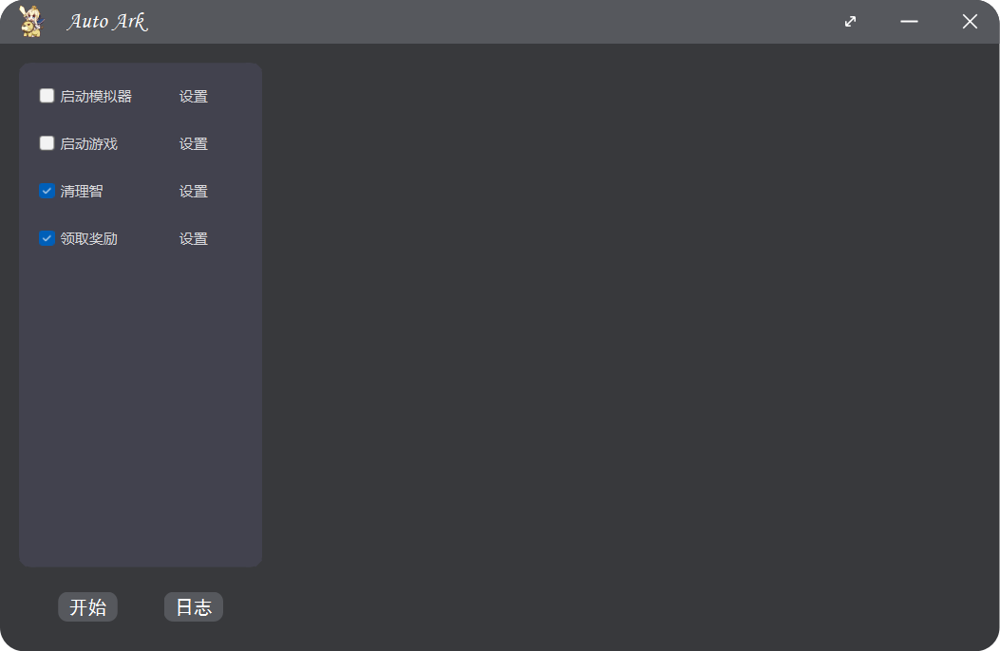

# auto_ark

明日方舟挂机脚本

#### 待完善

- [x] 清理智
- [x] 领取日常/周常奖励
- [x] gui
- [ ] 日志显示
- [ ] 设置功能

#### 开源库

- 图像识别：[opencv](https://github.com/opencv/opencv.git)
- 文字识别：[PaddleOCR](https://github.com/PaddlePaddle/PaddleOCR)
- 识别明日方舟地图中的格子坐标：[Arknights-Tile-Pos](https://github.com/yuanyan3060/Arknights-Tile-Pos)